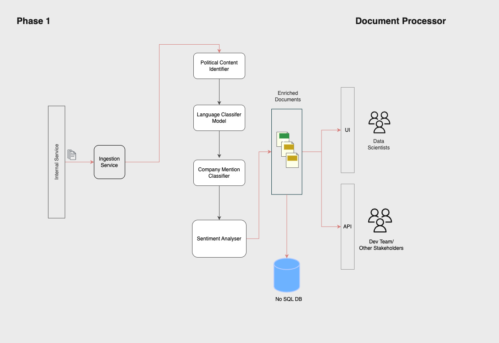
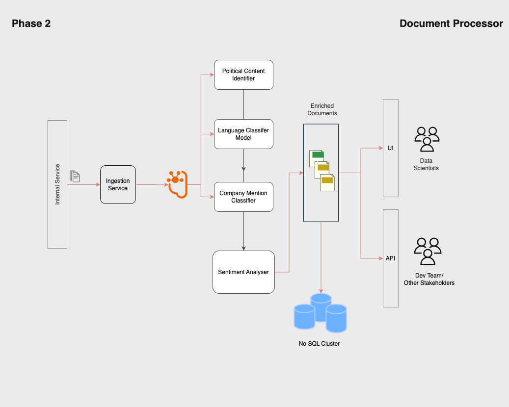
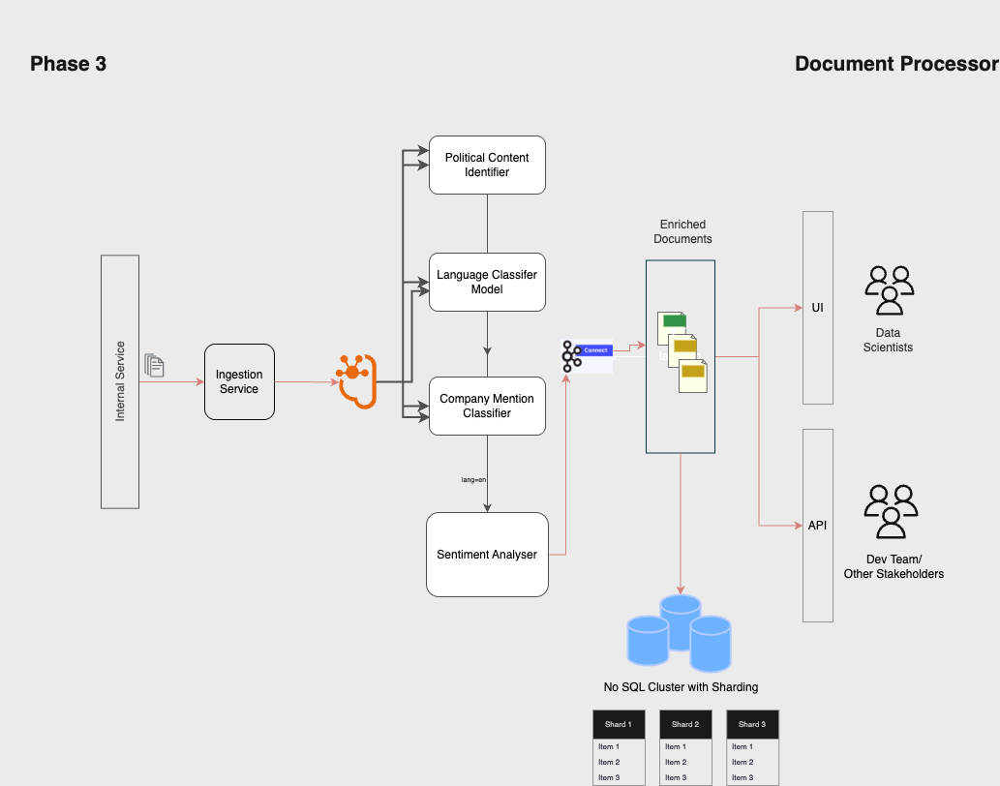

# System Design Exercise

Let us break the system design into **3 phases**, improving it over each phase.

### Phase 1: Basic Setup

In the beginning, let us assume we built a simple setup. Each document goes through all models one by one — first, we check for the language, then check for political content, then see if any company names are mentioned. If the language is English, we also check the sentiment (positive/neutral/negative). All of this happens in one go.

This is good for testing if the ML models are working properly and tuning them with a smaller number of documents (up to around 5 lakh per day).

#### Problems in this phase:

* If any model fails, the full process stops
* Everything is tightly joined, so changing one part is difficult
* No backup — if the system crashes, the documents are lost

#### What we should do next:

* Add a queue system so we can save documents before processing
* Separate model logic into different services

### Phase 2: Adding Kafka and Separate Services

Now we have made the system better. We added Kafka, which acts like a middleman. Documents are sent to Kafka first. Then, different model services (like political or language) pick them up and work on them separately.

Each model runs in its own container (using Docker). This helps us manage failures better and scale each service independently.

#### Problems in this phase:

* More parts make the system harder to manage
* Need to carefully handle duplicate processing
* Bringing all model results together takes effort

#### What we should do next:

* Run model checks (like political, language, and company) together in parallel
* Add a condition to run the sentiment check only if the document is in English

### Phase 3: Parallel Model Execution

We improved the processing further. Now, each document is checked by all models simultaneously — this saves time. And the sentiment check only runs when the document is in English. This way, we save computing resources and make it faster.

Each worker does their work independently and more efficiently. Sharding is used in DB for faster processing. We can process more documents this way — even up to 5M per day or more.

#### Problems in this phase:

* Collecting all model outputs together becomes a bit tricky
* Debugging is harder since things happen at the same time
* Need to balance the load, especially for heavier models like sentiment

#### What we can improve later:

* Use faster model serving systems like NVIDIA Triton
* Add Redis to store already processed documents, to avoid duplicate work
* Add a second pipeline for batch processing at night and real-time during day

  

I have done this using draw.io and downloaded the images to add to the repo. Thank you.

